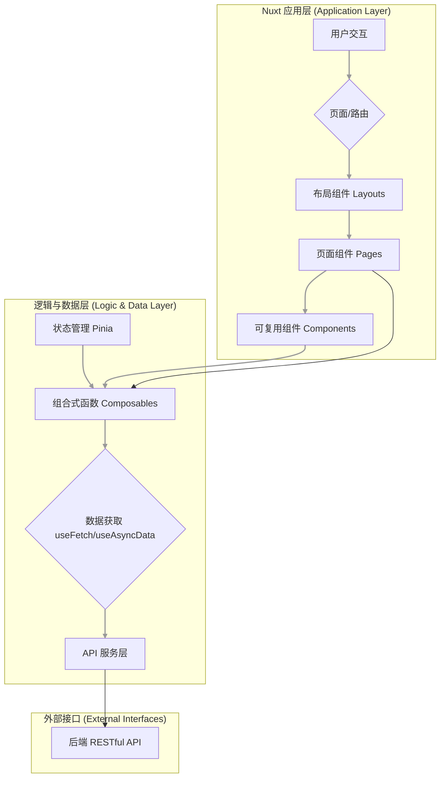

# 前端架构指南 {#summary}

## 1. 概述 (Overview)

本文档 **MUST** 作为所有前端开发的最高架构准则。它详细描述了项目的前端分层架构设计，旨在为开发人员提供清晰的指导，确保代码的组织性、可扩展性和可维护性。

## 2. 核心理念 (Core Concepts) {#core-concepts}

我们 **MUST** 采用分层架构（Layered Architecture），将应用的不同关注点进行分离。这种做法使得每一层都更加专注和内聚，从而提高代码质量和开发效率。

## 3. 架构图 (Architecture Diagram) {#architecture-diagram}

以下是前端应用的核心架构流程图，所有开发活动 **MUST** 遵循此图所示的结构和数据流向。

## 4. 各层详解 (Layer Details) {#layer-details}

### 4.1. Nuxt 应用层 (Application Layer) {#application-layer}

这一层 **MUST** 只负责视图的渲染和用户的交互。

-   **布局 (Layouts)**: **MUST** 定义应用不同部分的通用页面结构，例如默认布局应包含导航栏和页脚。详情请参考 [布局目录详解](./directory-structure.md#layouts-dir)。
-   **页面 (Pages)**: **MUST** 作为具体的页面组件。Nuxt 会根据 `pages/` 目录结构自动生成路由。每个页面 **MUST** 负责组织和展示其内容。详情请参考 [页面目录详解](./directory-structure.md#pages-dir)。
-   **组件 (Components)**: **MUST** 是可复用的 UI 单元（如按钮、卡片、弹窗）。它们 **SHOULD** 保持通用性，不与特定的业务逻辑强耦合。详情请参考 [全局组件目录详解](./directory-structure.md#components-dir)。

### 4.2. 逻辑与数据层 (Logic & Data Layer) {#logic-data-layer}

这一层 **MUST** 负责处理业务逻辑、状态管理和数据获取。

-   **状态管理 (Pinia)**: **MUST** 用于管理全局或跨组件共享的状态（如用户信息、主题设置）。每个 Store 模块 **MUST** 对应一个特定的功能领域。详情请参考 [状态管理目录详解](./directory-structure.md#stores-dir)。
-   **组合式函数 (Composables)**: **MUST** 作为封装和复用有状态逻辑的核心。例如，`useStudentData` **SHOULD** 封装获取学生数据的逻辑，`useAuth` **SHOULD** 封装用户认证的逻辑。这使得逻辑可以在多个组件之间轻松共享。详情请参考 [组合式函数目录详解](./directory-structure.md#composables-dir)。
-   **数据获取 (useFetch/useAsyncData)**: **MUST** 使用 Nuxt 提供的标准数据获取钩子，用于在服务端或客户端异步获取数据。
-   **API 服务层**: **MUST** 创建一个抽象层，将原始的 HTTP 请求（例如使用 `ofetch`）封装成更具语义的函数调用。例如，创建一个 `server/api/student.ts` 文件，其中包含 `getStudentById()`、`getClassList()` 等函数。这使得 API 的调用更加简单和统一。具体规范请遵循 [API 设计指南](../development/api-design.md)。

### 4.3. 外部接口 (External Interfaces) {#external-interfaces}

-   **后端 RESTful API**: 前端应用 **MUST** 通过 API 服务层与后端进行通信，获取或提交数据。

## 5. 数据流向 (Data Flow) {#data-flow}

所有数据流动 **MUST** 遵循以下标准流程：

1.  **用户访问**: 用户访问一个页面 (例如 `/class/grade-one/student/123`)。
2.  **路由匹配**: Nuxt 匹配到对应的页面组件 (`pages/class/[className]/student/[id].vue`)。
3.  **调用组合式函数**: 在页面组件的 `<script setup>` 中，**MUST** 调用对应的组合式函数，如 `useStudentData(studentId)`。
4.  **执行数据获取**: 组合式函数内部 **MUST** 使用 `useAsyncData` 来执行数据获取逻辑。
5.  **调用 API 服务**: `useAsyncData` **MUST** 调用 API 服务层中的函数，如 `api.student.getStudentById(studentId)`。
6.  **发起 HTTP 请求**: API 服务层函数 **MUST** 发起一个 HTTP 请求到后端 (例如 `GET /api/v1/students/123`)。
7.  **接收数据**: 后端返回数据。
8.  **数据回传**: 数据通过 API 层、`useAsyncData`、组合式函数最终传递回页面组件。
9.  **渲染与状态更新**: 页面组件使用获取到的数据来渲染视图。如果需要，**MAY** 将部分共享状态提交到 Pinia Store。